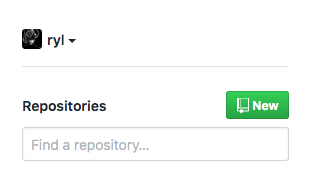

# GitHub Project Setup

## Step 1

[Create a free GitHub account](https://github.com/).

## Step 2

Create a new repository.

## Step 3

Create a new repository. Name you app using using the same pattern as your UNK
email, followed by the homework name. For example, `lowryrs-homework1`.

Make your project private.

