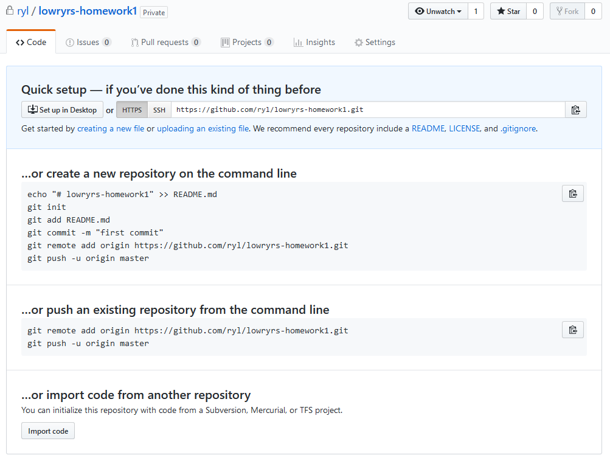
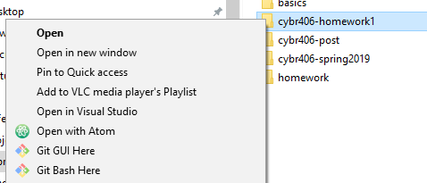
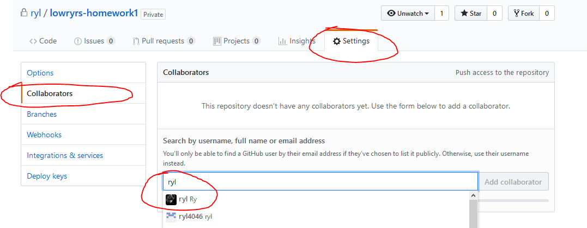
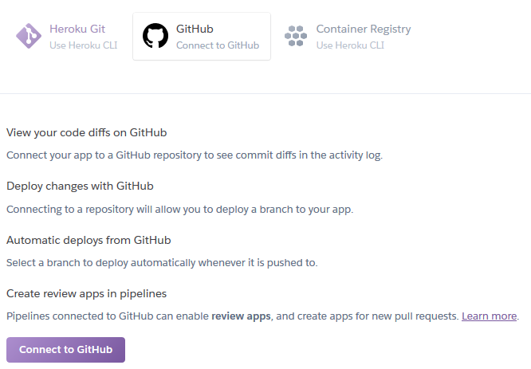
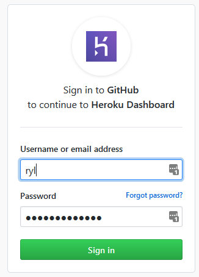
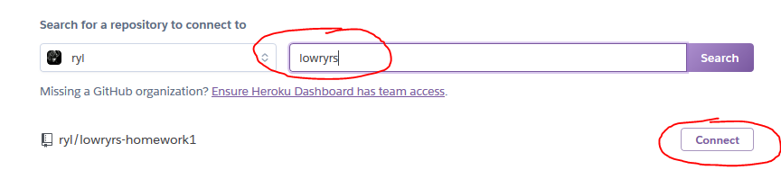
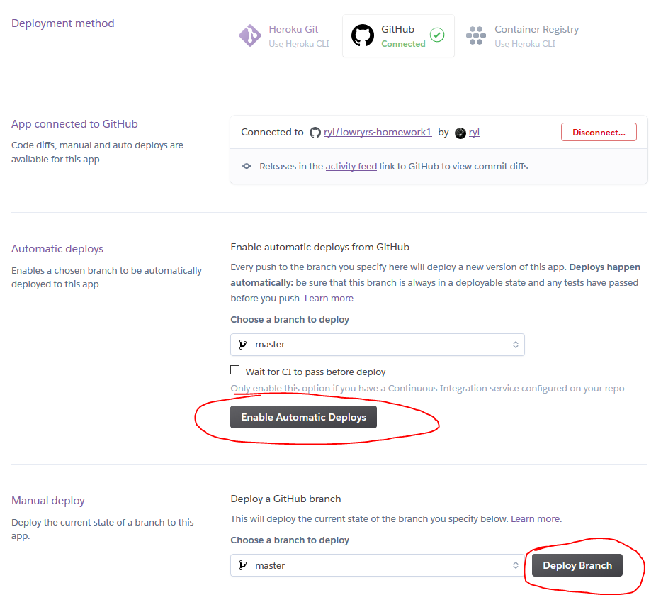
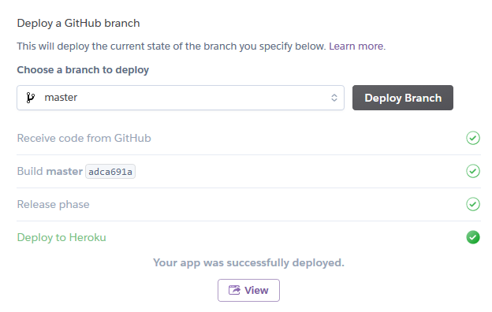

# GitHub Project Setup

## Step 1

[Create a free GitHub account](https://github.com/).

## Step 2

Create a new repository.


## Step 3

Create a new repository. Name your app using the same pattern as your UNK
email, followed by the homework name. For example, `lowryrs-homework1`.

Make your project private.


## Step 4

GitHub will display some instructions describing how to link your
project to your new repository using the command line. Make sure you have the
`HTTPS` option selected unless you have already configured SSH keys on your own.
If you are new to GitHub, `HTTPS` will be simpler to start out with.

I recommend initializing your project using the commands from the first code
block under the **…or create a new repository on the command line** code block,
but  with a few modifications (seen in step 6).



## Step 5

Navigate to your project using the command line. If you are using Windows, the
easiest way to do this is to right click your project folder, and select the
`Git Bash Here` option.



## Step 6

Once you have navigated to your project folder via the command line, execute the
following, modifying the URL to suit your own repository.

```
git init
git add .
git commit -m "first commit"
git remote add origin https://github.com/ryl/lowryrs-homework1.git
git push -u origin master
```

## Step 7

Add me as your a collaborator to your homework project.




# Link Heroku & GitHub

Now you can link your GitHub repository to a Heroku project. Navigate to an
existing Heroku project and select the `Deploy` tab.

Choose the `GitHub` option and click `Connect to GitHub`.










