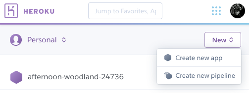

# Heroku Project Setup

## Step 1

[Visit your dashboard](https://dashboard.heroku.com/apps)
Create a new app in the top right corner.  

## Step 2

Name your app using the same pattern as your UNK
email, followed by the homework name. For example, `lowryrs-homework1`.

## Step 3

Use either the Heroku Git or GitHub methods for deployment. If you have the
Heroku CLI installed, choose Heroku Git. If you do not have it installed, use
GitHub and [link your GitHub repository to your Heroku project](github-project-setup.md).

## Step 4

Visit the `Access` page and click `Add a Collaborator`. Add lowryrs@unk.edu as
a collaborator.

