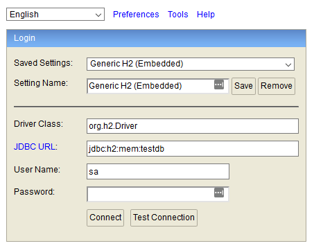

# In-Memory Databases

An in-memory database is a database that, not surprisingly, only lives in
memory. Contrast this with a persisted database, which stores its data in a
permanent fashion on some kind of media, like a hard drive.

In-memory databases are interesting because they only exist while the
application is running. When an in-memory database process is terminated, all
the data entered into it vanishes, never to be recovered again. This leads to
the question, "how is an in-memory database useful?"

* **They are small and embeddable.** Rather than requiring a separate piece of
  database software be installed on the server, the database can be packaged
  into the application itself. This also makes life easier for your coworkers.
  They can run your program without additional install tasks. _Just checkout and
  go!_
* When writing unit tests, it is important for tests to be independent of each
  other. Having a database that can forget all the data entered into it between
  tests helps prevent tests from affecting one another.

###### Real World Examples

| In-Memory              | Persisted                         |
|------------------------|-----------------------------------|
| [H2] (Used in class)   | [Mysql]                           |
| [HSQLDB]               | [PostgreSQ] (Used later in class) |

## Get Started With H2

In this class we will start out with H2. You can add H2 to a new project using
[Spring Boot Initializer], or by manually adding a dependency to `build.gradle`.

    dependencies {
        ...
        runtime('com.h2database:h2')
        ...
    }

Notice how this library was added as a `runtime` dependency. This means the jar
is only needed when the application is running, and is not needed to compile the
program itself. Spring will automatically detect this library when your
application starts and make use of it.

## Viewing Data with H2

H2 has a simple database UI you can enable in `application.properties`.

    spring.h2.console.enabled = true

This setting is one of the [Common Spring Properties]. After you launch your
application, visit http://localhost:8080/h2-console. Log in with the following
settings:

| Setting      | Value                   |
|--------------|-------------------------|
| Driver Class | org.h2.Driver           |
| JDBC URL     | jdbc:h2:mem:testdb      |
| User Name    | sa                      |
| Password     | Leave this field blank. |



This interface can be helpful when trying to understand the tables and data used
by your application.


## Getting Started With JPA

Short for Java Persistence API, JPA adds a layer between your Java application
and your database. It acts as an ORM (Object Relational Mapper) and **maps Java
objects to tables in a database.**

JPA can be added via [Spring Boot Initializer] or manually.

    dependencies {
        ...
        implementation('org.springframework.boot:spring-boot-starter-data-jpa')
        ...
    }

This dependency is added as an `implementation` dependency, meaning it is
required at compile time.

## JPA Example

Imagine we wanted to create an application that can save blog posts to a
database. Here is how we would begin using JPA:

1. Create a Java class that represents a post.
2. Annotate the post object with JPA annotations.
3. Create a repository for managing post objects.

### Post Object

```
import javax.persistence.*;

@Entity
public class Post {

    @Id
    @GeneratedValue(strategy = GenerationType.IDENTITY)
    Long id;

    String author;

    @Lob
    String content;

    // Getter and Setters...

}
```

* `@Entity` identifies the object as a class to be saved to the database.
* `@Id` identifies the field that **uniquely** identifies the object.
* `@GeneratedValue` indicates the database should generate this value. The
   strategy parameter indicates how to generate the value. There are [other
   possible values][GenerationType], but we will mostly use `IDENTITY`.
* `@Lob` indicates this field is a `Large Object`, and requires a database
  column that can store a large blob of data.

### Post Repository

A `Repository` is an interface that exposes CRUD-like (Create Retrieve Update
Delete) operations. It provides a means for interacting with the database.

```
import org.springframework.data.jpa.repository.JpaRepository;
import org.springframework.stereotype.Repository;

@Repository
public interface PostRepository extends JpaRepository<Post, Long> {

}
```

* `@Repository` identifies this interface as a repository.
* `PostRepository` is an interface, not a class.
* `PostRepository` extends from `JpaRepository` which takes 2 generic arguments
  `T` and `ID`.
    * `T` is the type of object this repository will manage. `Post` in this
      case.
    * `ID` is the data type of the object field marked with `@Id`. `Long` in
      this case. It must match the data type of the field that uniquely
      identifies the object.

Notice there is absolutely no code here. For now we will inherit functionality
from `JpaRepository`. In future exercises, we will add additional methods here.
To use the repository, `@Autowire` it into a controller.

```
@RestController
public class PostController {

    @Autowired
    PostRepository postRepository;

    @GetMapping("/posts")
    public Page<Post> posts(Pageable pageable) {
        return postRepository.findAll(pageable);
    }

}
```

The controller above demonstrates how a repository can be used to supply
paginated data. The `Pageable` allows the endpoint to accept `page`, `size`, and
`sort` parameters.

[h2]: http://www.h2database.com/html/main.html
[HSQLDB]: http://hsqldb.org/
[Mysql]: https://www.mysql.com/
[PostgreSQ]: https://www.postgresql.org/
[Common Spring Properties]: https://docs.spring.io/spring-boot/docs/current/reference/html/common-application-properties.html
[Spring Boot Initializer]: https://start.spring.io
[GenerationType]: https://docs.oracle.com/javaee/6/api/javax/persistence/GenerationType.html
